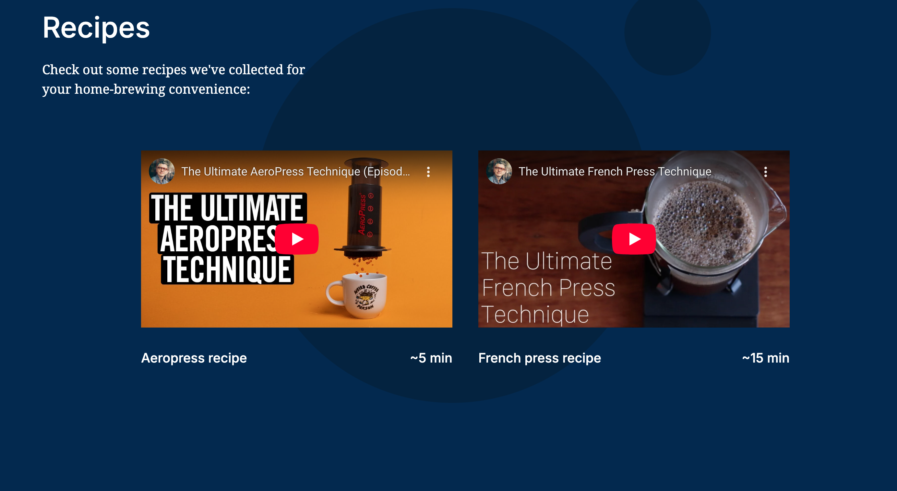

# Project 2: Triple Peaks Coffee Shop

## Overview

- Intro
- Video Overview
- Project Features
- Learning Journey
- Visuals
- Site Improvement

## Intro

This was my second project of the Software Engineering program at TripleTen. It was created using HTML and CSS, based on the design brief.

## Video Overview

- https://drive.google.com/file/d/1Zk4DifWAj570gBAezcK2b3GpM3NJyfd4/view?usp=sharing

## Project features

- Semantic HTML5
- Flexbox
- Positioning
- Flat BEM file structure
- A custom form
- Adding and customizing videos from YouTube
- CSS animation and transform

## Learning journey

- During this project I feel like I really began to grasp how to manipulate the website appearance using flexbox, padding, and margins. Across several stages, I added to this landing page to add the different sections. Still one of the coolest things to me was when I clicked one of the navigation links and had it jump to one of the page sections! A real website!

## Visuals

## Plans to improve the project

- Currently, no plans to update the project. But from what I just learned in JavaScript, I could utilize that to create a modal for the form. That would clean up the site and the code and make the space more efficient. I could also add a "Reviews" section as well. Even a feed of the coffee shop's social media posts to show current content or updates. Might be nicely done with a widget.

### Thanks for reading and be well!

Stuart
